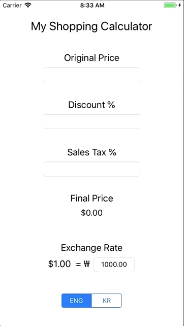

# # Fall 2018 :: CSE438 Lab1 My Shopping Calculator
It is a simple shopping calculator that calculates the final price of a product based on its original price, the current discount percentage, and the local sales tax.

# # Build Environment
  - Xcode 9.4
  - Swift 4
  - iPhone 8 

# # Features
  - Users can input the original price, discount percentage, and sales tax percentage for a given product.
  - Whenever a text field is changed, the final price of the product is updated live.
  - Users can change languages between English and Korean. Based on the current language, a corresponding currency sign will be used. 
 
# # Design Choices
  - When the app is run for the first time, the empty UITextField values are treated as 0,  thus making the Final Price to be $0.00 (because tax is multiplied) until every field is filled for the first time. From there, the final price will be responsive based on the change of the input values.
  - Large numbers are handled by limiting the length of UITextField to 10 digits.
  - The fields will only take digits [0-9] and decimal point.

# # Demo
> The following demo shows the basic functionality of this app.  
>   
>
> The following demo shows the language and currency conversion feature.  
> 